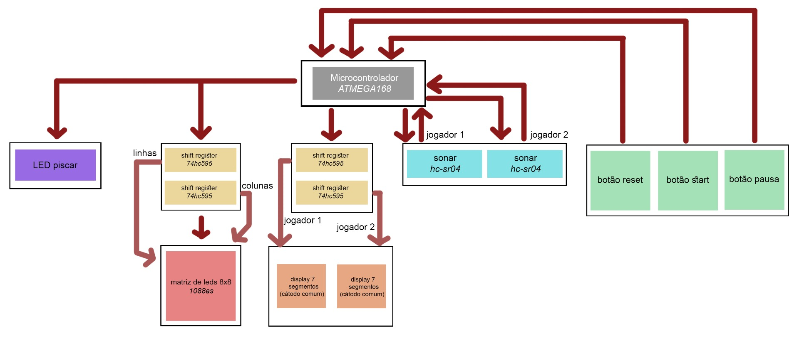

# SonarPong

A hardware-based implementation of the classic **Pong** game running on an ATmega168 microcontroller, with player-controlled paddles using ultrasonic distance sensors and an LED matrix as the game display.

The project combines embedded C programming, hardware timers, external interrupts, ultrasonic sensing, LED matrix multiplexing, shift registers, and real-time game physics.

## Demo

[![Sonar Pong demo]](assets/sonar_pong_demo.mp4)

The game supports:

* Two-player gameplay
* Paddle control using two HC-SR04 ultrasonic sensors
* Start, pause, and reset controls
* Real-time ball physics and collision detection
* Score tracking using two 7-segment displays
* Countdown animations between rounds
* Winner indication
* LED status indicator

---

## System Overview

The system uses an **ATmega168** as the central controller. The microcontroller measures the distance from each player's hand to an HC-SR04 ultrasonic sensor and maps that distance to the corresponding paddle position.

The game state and physics are processed by the microcontroller, while the display is driven through shift registers to reduce the number of GPIO pins required.

---

## Hardware

### ATmega168

The **ATmega168** is the central microcontroller used to run the game.

The implementation uses all three available hardware timers:

* Timer 0
* Timer 1
* Timer 2

It also uses the two external interrupts:

* `INT0`
* `INT1`

### HC-SR04 Ultrasonic Sensors

Two **HC-SR04 ultrasonic sensors** are used to control the player paddles.

Each sensor provides:

* Power
* Ground
* Trigger
* Echo

The microcontroller sends a trigger pulse and measures the duration of the returned echo signal. This measurement is converted into a distance and then mapped to a paddle position.

The usable hand-distance range for the game is approximately **10–50 cm**.

### LED Matrix

The game is displayed using an **8×8 LED matrix**.

Two **74HC595 shift registers** are used to control the matrix:

* One shift register controls the rows
* One shift register controls the columns

The matrix is multiplexed by activating one row at a time at a high refresh rate. Due to persistence of vision, the complete game display appears simultaneously to the player.

### Buttons

Three buttons provide game control:

1. Start
2. Pause
3. Reset

### Status LED

A blinking LED is used as a system status indicator.

The LED alternates between on and off states every 0.5 seconds.

### 7-Segment Displays

Two 7-segment displays show the current score of each player.

---

## Electrical Design

The complete circuit was designed in **KiCad**.

The original design also included a PCB layout intended to accommodate four 8×8 LED matrices and form a larger 16×16 display.

The final implementation was adapted to use a single 8×8 LED matrix.

---

## Software

The game is implemented in **C** for the ATmega168.

The software is organized around game-state handling, input processing, display updates, timing, and physics.

### Game Flow

The game starts at the start screen and waits for the player to press the start button.

Each round:

1. A player is selected to serve.
2. The score is updated when required.
3. The initial ball position and velocity are generated.
4. A 3-to-1 countdown is displayed.
5. The game starts.
6. Ball movement and collisions are continuously calculated.
7. The round ends when a player scores.
8. The next round starts or the game ends when a player reaches 9 points.

### Game State

The main game functionality is divided into several functions.

| Function                 | Purpose                                                     |
| ------------------------ | ----------------------------------------------------------- |
| `init`                   | Configures ports, timers, and interrupts                    |
| `start`                  | Initializes the game display and waits for the start button |
| `start_round`            | Initializes a new round and updates the score               |
| `display_sete_segmentos` | Updates the 7-segment displays                              |
| `fim_jogo`               | Handles the end-of-game state                               |
| `pause_game`             | Pauses and resumes the game                                 |
| `input_sonar`            | Triggers the ultrasonic sensors                             |
| `physics`                | Calculates ball movement and collisions                     |
| `add_arrayy_to_matrix`   | Adds an image to the LED matrix                             |
| `matriz_display`         | Updates the LED matrix display buffer                       |
| `handle_input`           | Converts sonar timing into paddle position                  |

---

## Interrupts and Timers

The game relies heavily on hardware timers and external interrupts to coordinate input, display refresh, and game timing.

### Timer 0 — Display Refresh

Timer 0 generates an interrupt every **0.5 ms**.

On each interrupt, the next LED matrix row is selected and its corresponding column data is transmitted.

Only one row is active at a time. The refresh frequency is high enough that persistence of vision makes the entire matrix appear continuously illuminated.

Timer 0 also handles:

* Countdown display
* Status LED toggling
* Winner animation

### Timer 1 — Ultrasonic Timing

Timer 1 coordinates the two ultrasonic sensors.

After 12 ms, it triggers the second sonar. Once both sensors have completed their measurements, the timer stops.

### Timer 2 — Frame Timing

Timer 2 generates an interrupt every **8 ms**.

It is used to measure the time taken by each frame so that the next ball position can be calculated according to the elapsed time.

### `INT0` and `INT1` — Sonar Echo

The two external interrupts handle the echo signals from the ultrasonic sensors.

When an echo signal is active, the corresponding timer counter is captured and passed to `handle_input`.

### Input Processing

`handle_input` converts the captured timer value into a distance in centimeters and then maps that distance to the corresponding paddle position.

---

## Ball Physics

The `physics` function calculates the next position and velocity of the ball while handling collisions with the walls and paddles.

Collision detection is performed recursively when the calculated movement would result in multiple collisions within a single frame.

For example, if the potential ball position crosses both the x and y boundaries, the function determines which collision occurs first. It then:

1. Calculates the intersection point.
2. Updates the ball position to the collision point.
3. Updates the velocity vector.
4. Calculates the remaining movement.
5. Checks again for additional collisions.
6. Updates the final ball position.

When the ball hits a paddle, its new velocity depends on the relative position of the collision on the paddle.

The ball also increases in speed as the rally progresses. Every 10 hits, its velocity magnitude increases by 20%, up to a maximum magnitude of 12.

*Ball collision and movement calculation*

*Physics flowchart*

---

## Display Multiplexing

The LED matrix is updated one row at a time.

At each Timer 0 interrupt:

1. The next row is selected.
2. The corresponding column data is loaded into the shift registers.
3. The row is activated.
4. The process repeats for the next row.

With a refresh frequency of approximately **2 kHz**, persistence of vision makes the individual row updates appear as a single complete image.

---

## Game Screens

### Start

The game initially displays a start screen and waits for a player to press the start button.

### Round Countdown

After a player scores, a countdown from 3 to 1 is displayed before the next round begins.

### Pause

The pause button displays a pause symbol and stops the game until the button is pressed again.

### Winner

When a player reaches 9 points, the game displays the number of the winning player.

---

## Results

The final implementation provides a playable two-player Pong game controlled entirely through physical hardware.

The completed system supports:

* Real-time paddle control through ultrasonic sensors
* Interrupt-driven input handling
* Hardware-timer-based scheduling
* LED matrix multiplexing
* Shift-register-based display control
* Real-time ball physics
* Collision detection
* Dynamic ball speed
* Score tracking
* Start, pause, and reset states
* Countdown and winner animations

The final display uses a single 8×8 LED matrix. The original hardware design was intended to use four matrices to create a 16×16 display, but the implementation was adapted to the available hardware.

---

## Possible Improvements

Some possible extensions include:

* **Larger display** — use multiple LED matrices to improve visibility.
* **Single-player mode** — play against the computer or against a wall while counting successful hits.
* **Multicolor display** — use a multicolor LED matrix for additional customization.
* **Sound** — add a buzzer for collisions, scoring, and other game events.

---

## References

* [ATmega168 Datasheet](http://ww1.microchip.com/downloads/en/DeviceDoc/Atmel-9365-Automotive-Microcontrollers-ATmega88-ATmega168_Datasheet.pdf)
* [HC-SR04 Datasheet](https://pdf1.alldatasheet.com/datasheet-pdf/view/1132203/ETC2/HC-SR04.html)
